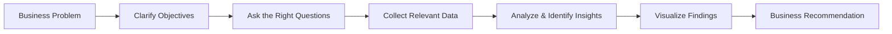

  

<h3 align="center">Business Analytics | Strategy • Insights • Decision Making</h3>

📊 Translating data into business impact  
💼 Analytical thinking with a strong business mindset

  

---

## 👨‍💼 Professional Overview
- 🎓 MBA Student specializing in **Business Analytics**
- 📈 Passionate about **data-backed business decisions**
- 🧠 Strong analytical & structured problem-solving mindset
- 📊 Experienced in dashboards, reports & insight storytelling

---

## 🎯 What I Bring as a Business Analyst
- 🔍 Understanding business problems before jumping into data  
- 📐 Defining KPIs aligned with business objectives  
- 📊 Analyzing trends, patterns & performance metrics  
- 📈 Communicating insights clearly to support decisions  

---

## 🛠️ Core Skills & Tools

  
  
  

  
  
  

---

## 📚 Currently Strengthening
- Advanced SQL for analytical use cases  
- KPI-driven dashboards & reporting  
- Case-based business analysis  
- Insight storytelling for stakeholders  

---

## 🧠 How I Approach Business Problems (BA Workflow)

---

## 🤝 Connect With Me

  
  

⭐ Building analytics skills for real-world business impact

  

